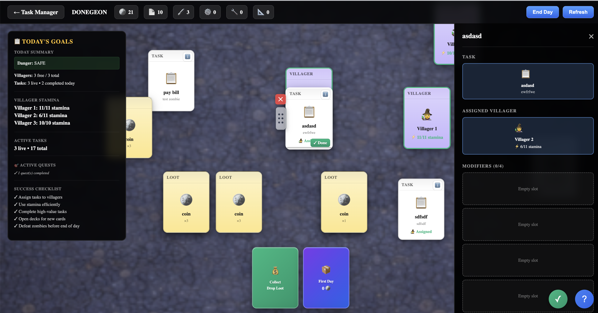

# 🎮 DONEGEON



**A Task management game where productivity meets dungeon survival.**

Donegeon transforms your daily tasks into an engaging card-based game. Manage villagers, complete tasks, fight zombies spawned by procrastination, and survive the overrun of neglected responsibilities.

## 🌟 Core Concept

Your tasks are **cards** on a **board**. Drag villagers onto tasks to work on them, collect loot as rewards, and watch out for zombies that spawn when you miss deadlines or ignore important work.

## 🎯 Key Features

### 📋 Task Management (Todoist-Level Parity)
- **Zones**: Tasks flow through `inbox → live → completed → archived`
- **Recurring Tasks**: Auto-spawn on day tick when charges are available
- **Projects**: Organize tasks into projects for better structure
- **Tags**: Categorize tasks (deep_work, admin, quick, meeting)
- **Work Progress**: Tasks accumulate progress based on villager speed
- **Modifiers**: Attach cards like Deadline Pin, Recurring Contract, Importance Seal

### 🧑‍🌾 Villager System
- **Stamina**: Each villager has limited energy per day (resets on day tick)
- **Speed**: Higher speed = tasks complete faster (speed 2 = 2x faster)
- **Leveling**: Complete 5 tasks → level up → +1 max stamina
- **Tired Status**: 4+ zombies tire villagers for 24 hours
- **Assignments**: Drag villagers onto tasks to assign work

### 🧟 Zombie Pressure System
- **Spawning Rules**:
  - **Deadline Missed**: ⏰ Task passed deadline → zombie spawns
  - **Important Ignored**: ⚠️ Important task left in live for 2+ days → zombie
  - **Recurring Failed**: 🔁 Recurring contract runs out of charges → zombie
- **Penalties**:
  - 4+ zombies: Villagers become tired
  - Zombies block work capacity
  - Increase pack costs and reduce loot drops
- **Combat**: Drag villager onto zombie (costs 2 stamina) to clear

### 🎴 Card Stacking 
Drag and drop cards onto each other to create interactions:

```
Villager + Task = Assign work (consumes stamina, adds progress)
Modifier + Task = Apply modifier (deadline, recurring, importance)
Villager + Zombie = Attack zombie (costs 2 stamina)
Food + Villager = Restore stamina
Villager + Resource = Gather materials
```

### 🎁 Loot & Economy
- **Task Completion Rewards**: Coins, paper, ink, gears, parts, blueprint shards
- **Loot Types**: Based on task tags (deep_work → parts, admin → paper)
- **Decks**: Buy card packs with coins
  - **First Day Deck**: Blank tasks, villagers, basic modifiers
  - **Organization Deck**: Advanced planning tools (unlocks at 10 tasks)
  - **Maintenance Deck**: Resources and automation

### 🏗️ Buildings
- **Project Board**: Organize tasks into projects
- **Rest Hall**: Recover villager stamina faster
- **Calendar Console**: Advanced scheduling
- **Routine Farm**: Automate recurring tasks
- **Automation Forge**: Reduce stamina costs

### 📊 Today Summary
Real-time game state dashboard showing:
- **Danger Level**: Safe → Warning → Danger → Overrun
- **Villagers**: Free vs blocked
- **Tasks**: Live tasks and today's completions
- **Zombies**: Active threats

## 🚀 Getting Started

### Prerequisites
- Go 1.21+
- Node.js 18+
- npm or yarn

### Installation

```bash
# Clone the repository
git clone https://github.com/dragonbytelabs/donegeon
cd donegeon

# Install frontend dependencies
cd web
npm install
npm run build
cd ..

# Build and run the server
go build .
./donegeon
```

The app will be available at `http://localhost:42069`

### Development Mode

```bash
# Terminal 1: Run backend
go run .

# Terminal 2: Run frontend dev server
cd web
npm run dev
```

## 🎮 How to Play

### 1. Start Your Day
- Server starts with a fresh world
- Open the **First Day Deck** (press `E` or click button)
- Draw **Blank Task Cards** and **Villagers**

### 2. Create Tasks
- Click on a blank task card to fill it in
- Enter task name and description
- Tasks appear in your inbox, then move to "live" when ready

### 3. Assign Work
- **Drag a villager** onto a **task card**
- Villager consumes 1 stamina
- Task accumulates work progress based on villager speed
- Higher speed villagers complete tasks faster

### 4. Complete Tasks
- When task is completed, press Done
- Earn **loot drops** (coins, materials)
- Villager gains XP toward next level
- Task moves to **completed zone**

### 5. Manage Zombies
- Watch for zombies spawning from neglect
- **Drag villager onto zombie** to attack (costs 2 stamina)
- Clear zombies before end of day to avoid penalties

### 6. End Your Day
- Click **End Day** button (or press `Space`)
- Villager stamina resets
- Recurring tasks spawn if charged
- Zombies spawn from missed deadlines
- Danger level recalculates

## 🎯 Game Mechanics Deep Dive

### Work Speed Formula
```
Progress per stamina use = (villager_speed / 8.0) * hours_worked
Default: 1 hour worked per stamina
Speed 1: 1/8 progress (8 stamina to complete)
Speed 2: 2/8 progress (4 stamina to complete)
Speed 3: 3/8 progress (3 stamina to complete, faster!)
```

### Stamina Costs by Task Type
```
quick task:     1 stamina
admin task:     1 stamina
meeting:        2 stamina
deep_work:      3 stamina
```

### Loot Drop Tables
```
deep_work:   parts (75%) or blueprint_shard (25%)
admin:       paper (60%), ink (30%), coin (10%)
meeting:     coin (70%), paper (30%)
quick:       coin (50%), paper (30%), ink (20%)
default:     coin (100%)
```

### Zombie Spawn Conditions
1. **Deadline Missed**: Task has deadline_pin modifier and deadline passes
2. **Important Ignored**: Task has importance_seal and sits in live 2+ days
3. **Recurring Depleted**: recurring_contract has 0 charges when it fires

### Danger Levels
```
0 zombies:   SAFE    (green)
1-2 zombies: WARNING (yellow)
3-4 zombies: DANGER  (red)
5+ zombies:  OVERRUN (dark red) - villagers tired for 24h
```

## 🎨 Board Controls

### Keyboard Shortcuts
- `Space` - End day (advance to next day)
- `R` - Refresh board state
- `E` - Open first available deck
- `1` - Open First Day deck
- `2` - Open Organization deck
- `3` - Open Maintenance deck
- `Escape` - Close detail panel

### Mouse Controls
- **Click & Drag** - Move cards around the board
- **Drop on Card** - Stack/combine cards (see card interactions)
- **Click Card** - View details
- **Scroll** - Pan camera (when implemented)

## 📁 Project Structure

```
donegeon/
├── main.go                 # Server entry point
├── go.mod                  # Go dependencies
├── internal/
│   ├── building/          # Building entities and repos
│   ├── deck/              # Card deck system
│   ├── game/              # Core game engine and clock
│   │   ├── engine.go      # Main game logic (DayTick, CompleteTask)
│   │   └── clock.go       # Time management
│   ├── loot/              # Loot drops and inventory
│   ├── modifier/          # Modifier cards (deadline, recurring, etc)
│   ├── project/           # Project organization system
│   ├── quest/             # Quest and objective system
│   ├── recipe/            # Card combination recipes
│   ├── server/            # HTTP API and routes
│   │   ├── api.go         # REST endpoints
│   │   └── routes.go      # Route registration
│   ├── task/              # Task entities and lifecycle
│   │   ├── task.go        # Task model with zones
│   │   └── repo_memory.go # In-memory task storage
│   ├── villager/          # Villager stats and leveling
│   ├── world/             # World state (day counter)
│   └── zombie/            # Zombie spawning and penalties
│       ├── zombie.go      # Zombie entity
│       └── reason.go      # Spawn reason constants
└── web/                   # Frontend React app
    ├── src/
    │   ├── game/          # Game board components
    │   ├── lib/           # API client and types
    │   ├── pages/         # Main pages (BoardPage, ProjectsPage)
    │   └── routes/        # React Router routes
    └── dist/              # Built static assets
```

## 🔧 API Endpoints

### Tasks
- `GET /api/tasks` - List all tasks
- `GET /api/tasks/inbox` - Tasks in inbox zone
- `GET /api/tasks/live` - Active tasks
- `GET /api/tasks/completed` - Completed tasks
- `POST /api/tasks` - Create new task
- `POST /api/tasks/complete` - Complete a task (with loot drops)
- `POST /api/tasks/process` - Work on task (consumes stamina, adds progress)
- `POST /api/tasks/move-to-live` - Move task from inbox to live
- `POST /api/tasks/set-project` - Assign task to project

### Villagers
- `GET /api/villagers` - List all villagers
- `POST /api/villagers` - Create villager

### Zombies
- `GET /api/zombies` - List active zombies
- `POST /api/zombies/clear` - Attack zombie (costs stamina)

### Projects
- `GET /api/projects` - List projects
- `POST /api/projects` - Create project
- `POST /api/projects/{id}/archive` - Archive project

### Game State
- `GET /api/today` - Get today's summary (danger level, villagers, tasks)
- `POST /api/day-tick` - Advance to next day

### Decks & Loot
- `GET /api/decks` - List available decks
- `POST /api/decks/{id}/open` - Open a deck (costs coins)
- `GET /api/loot` - Get inventory
- `POST /api/loot/collect` - Collect loot from board

## 🎯 Design Principles 

### Task-First Architecture
- Tasks are first-class citizens, not just TODOs
- Game mechanics built around task lifecycle
- Loot, zombies, and pressure all derive from task state

### Card System 
- Physical card manipulation feels satisfying
- Drag-and-drop everything
- Visual stacking creates emergent gameplay
- Spatial memory aids task recall

## 🔮 Future Roadmap (v0.2+)

### Planned Features
- [ ] Persistent storage (SQLite or PostgreSQL)
- [ ] Multi-player co-op mode
- [ ] Calendar integration (Google Calendar, Outlook)
- [ ] Advanced automation (workflow triggers)
- [ ] Boss fights (end-of-season challenges)
- [ ] Seasonal themes and visual progression
- [ ] Sound effects and music
- [ ] Mobile app (React Native)
- [ ] Achievement system
- [ ] Cloud sync

### Under Consideration
- Real-time collaboration
- Task delegation to teammates
- API integrations (GitHub, Jira, etc)
- Custom card creation
- Mod support

**Made with ❤️ and too many missed deadlines**

*"Your procrastination is now a boss fight."*
